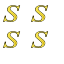

##  Grid ShapeString

Lets you wrap multiple strings onto a 2D grid of rows and columns.

Set how many columns wide the grid is; once that many strings have  
been placed, layout wraps to a new row underneath. Column and row  
spacing are configured independently, so rows don't have to be as  
tightly packed as columns (or vice versa).

Leaving an entry blank still reserves its position in the grid - use  
this to leave gaps, e.g. for an L-shaped layout of labelled tiles.

The result is a regular FreeCAD shape object that works with  
**Part** and **PartDesign** operations for engraving or embossing.

<br/>

## Use Cases

-   **Labelled tile plaques**  
    Laying out a grid of distinct labels for tiles, keys, or panels  
    that will be engraved or embossed as a single plate.

-   **Keypad legends**  
    Generating the row/column legends for a keypad or button panel  
    where each position needs its own text.

-   **Reference/lookup grids**  
    Producing a small grid of codes, coordinates, or index labels  
    (e.g. "A1", "A2", "B1", "B2", ...) for a jig or fixture.

-   **Sparse/irregular layouts**  
    Leaving some grid positions blank to lay out an L-shaped or  
    otherwise irregular arrangement of labels within a rectangular grid.

<br/>

## Properties

-   `Strings`  
    List of text entries to render, read row-major (left to right,  
    then wrapping to the next row down). A blank entry still occupies  
    its grid position - it just renders nothing there.

-   `Columns`  
    Number of columns before layout wraps to a new row.

-   `FontFile`   
    Path to the font file used for rendering.  
    Examples : `.ttf` or `.otf` files

-   `Size`  
    Height of the rendered text, in model units.

-   `ColumnOffset`  
    Horizontal spacing value applied between columns.

-   `RowOffset`  
    Vertical spacing value applied between rows. Rows stack downward  
    (in -Y) as `Strings` is read from the start, matching reading order.

-   `UseBoundingBox`  
    Controls how `ColumnOffset`/`RowOffset` are interpreted:
    - `False` : Columns/rows are placed at a fixed pitch  
    (`ColumnOffset`/`RowOffset` apart), regardless of character widths.  
    - `True` : Each column is sized to its widest string and each row  
    to its tallest string, with `ColumnOffset`/`RowOffset` added as the  
    visible gap on top of that.

<br/>

## Creation

1.  Navigate to the `Draft` workbench.

2.  Click the  `Grid ShapeString` action.

    *A task panel should open*

3.  In the task panel do the following:

    A.  Select the object position.

    B.  Set the number of columns.

    C.  Fill in the strings table - one cell per grid position.  
        Use `Add Row` / `Remove Row` to grow or shrink the grid, and  
        leave a cell blank to skip that position. Changing the column  
        count reflows the existing entries into the new shape.

    D.  Select the file of the font.

    E.  Adjust the font size / height.

    F.  Configure the column offset and row offset.

    *Set the bounding box option*  
    *to size columns/rows by their content instead of a fixed pitch.*

    G.  Finish the operation by  
        clicking the `Ok` button.

<br/>

## Python

To run the following code, paste it into FreeCAD's  
Python console while you have a document open.

```Python
from ShapeStrings import Grid

Grid(
    UseBoundingBox = False ,
    FontFile = '/path/to/font.ttf' ,
    Strings = [ 'A1' , 'A2' , 'A3' , 'B1' , 'B2' , 'B3' ] ,
    Columns = 3 ,
    ColumnOffset = 5 ,
    RowOffset = 8 ,
    Size = 10 ,
)
```
