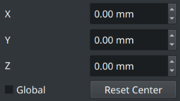
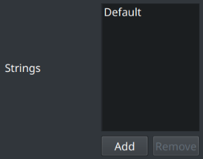
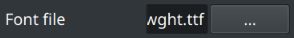
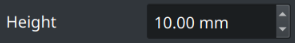
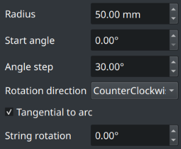

#  Radial ShapeStrings

Lets you place multiple strings around a common center point.

You control the radius, starting angle, and angular step,  
so each string lands at a predictable polar position.

Strings can be oriented tangentially to the circle - ideal for gauges  
and knobs - or kept horizontal for documentation‑style layouts. 

The result is a regular FreeCAD shape object that works with  
**Part** and **PartDesign** operations for engraving or embossing.

<br/>

## Preview


<br/>

## Use Cases

-   **Dial face labels**  
    Labeling gauge or dial faces (e.g. “0, 10, 20, …” or  
    “LOW, NORM, HIGH”) around a circular pointer indicator.  

-   **Bolt‑circle notes**  
    Adding bolt‑circle annotations (e.g. “8x M8”, “Ø10 THRU”)  
    equally spaced around a flange or hub.  

-   **Compass / direction marks**  
    Creating compass roses or directional markers (“N, NE, E, …”)  
    on navigation instruments or panel graphics.  

-   **Rotary index positions**  
    Marking positions around a rotary switch, indexing plate,  
    or turret (e.g. “1–12”) for repeatable angle settings.  

-   **Knob legends**  
    Designing radial legends around knobs, volume controls,  
    or selector dials on audio and industrial equipment.  

-   **Circular badge text**  
    Generating circular text for badges, coins, medallions,  
    or ornamental rings where wording must follow a circle.

<br/>

## Properties

-   `Strings`  
    List of text entries to render, each placed  
    at a different angle around the center.

-   `FontFile`   
    Path to the font file used for rendering.  
    Examples : `.ttf` or `.otf` files

-   `Size`  
    Height of the rendered text, in model units.

-   `Radius`  
    Distance from the center point to the text baseline.

-   `StartAngle`  
    Angle (in degrees) for the first string.  
    By convention, `0°` lies along the +X axis.

-   `AngleStep`   
    Angular increment (in degrees) between successive strings.

-   `Tangential`  
    When `True`, each string is rotated  
    so its baseline is tangent to the circle.
    
    When `False`, all text remains  
    parallel to the global X axis.

-   `RotationDirection`  
    Direction in which angles advance when laying   
    out strings: `CounterClockwise` or `Clockwise`.

-   `StringRotation`  
    Extra rotation angle (in degrees) applied uniformly to  
    every string, after tangential or horizontal alignment.

<br/>

## Creation

1.  Navigate to the `Draft` workbench.

2.  Click the  `Radial ShapeString` action.

    *A task panel should open*

3.  In the task panel do the following:

    A.  Select the object position.

    

    B.  Add, edit or remove strings.

    

    C.  Select the file of the font.

    

    D.  Adjust the font size / height.

    

    E.  Configure the radial options.

    

    F.  Finish the operation by  
        clicking the `Ok` button.

<br/>

## Python

To run the following code, paste it into FreeCAD's  
Python console while you have a document open.

```Python
from ShapeStrings import Radial

Radial(
    RotationDirection = 'CounterClockwise' ,
    StringRotation = 0 ,
    Tangential = True ,
    StartAngle = 0 ,
    AngleStep = 30 ,
    FontFile = '/path/to/font.ttf' ,
    Strings = [ '1' , '2' , '3' , '4' , '5' ] ,
    Radius = 50 ,
    Size = 4 ,
)
```
