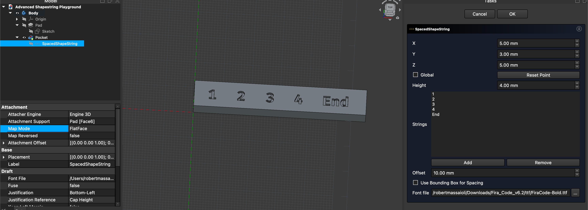
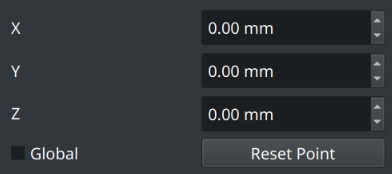
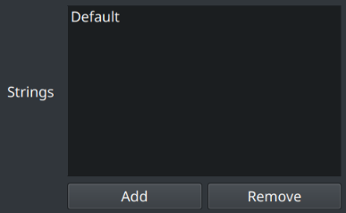
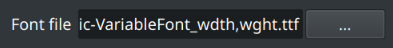
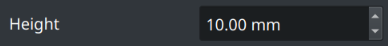
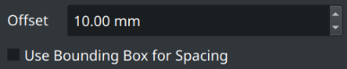

##  Spaced ShapeString

Lets you place multiple strings side by side to each other.

The offset you choose always applies, either setting where  
each string starts relative to the last, or keeping the visible  
gap between strings constant.

The result is a regular FreeCAD shape object that works with  
**Part** and **PartDesign** operations for engraving or embossing.

<br/>

## Preview



<br/>

## Use Cases

-   **Slot numbering**  
    Numbering individual slots, pockets, or cavities along a plate or  
    rail so each feature has a clear index for assembly or inspection.  

-   **Serial ID rows**  
    Creating a row of serial numbers or IDs on a nameplate, tag  
    strip, or terminal block that will be engraved or embossed.  

-   **Connector edge labels**  
    Laying out repeated text labels (e.g. “IN”, “OUT”, “GND”, “+5V”)  
    along the edge of a PCB or electronics enclosure.  

-   **Process step markers**  
    Generating dimension or step labels (“Step 1”, “Step 2”, …)  
    along a process panel or jig to guide an operator.  

-   **Linear scale text**  
    Producing evenly spaced text for ruler‑like scales,  
    linear indicators, or calibration bars on a straight edge.  

-   **Decorative text bands**  
    Creating decorative repeated words or phrases along a straight  
    band that will later be wrapped or mapped onto a surface.

<br/>

## Properties

-   `Strings`  
    List of text entries to render, each placed  
    at a different angle around the center.

-   `FontFile`   
    Path to the font file used for rendering.  
    Examples : `.ttf` or `.otf` files

-   `Size`  
    Height of the rendered text, in model units.

-   `Offset`  
    Horizontal spacing value applied between strings.  
    This value is always used when positioning each subsequent string.

-   `UseBoundingBox`  
    Controls how the offset is interpreted when laying out the strings:
    - `False` : Each string’s insertion point is placed  
    at a fixed offset from the previous string’s  
    insertion point, regardless of character widths.  
    - `True` : The visible gap between the end of one string  
    and the start of the next is kept equal to the offset,  
    using each string’s bounding box to measure its width.

<br/>

## Creation

1.  Navigate to the `Draft` workbench.

2.  Click the  `Spaced ShapeString` action.

    *A task panel should open*

3.  In the task panel do the following:

    A.  Select the object position.

    

    B.  Add, edit or remove strings.

    

    C.  Select the file of the font.

    

    D.  Adjust the font size / height.

    

    E.  Configure the offset amount.

    

    *Set the bounding box option*  
    *to space strings by their width.*

    F.  Finish the operation by  
        clicking the `Ok` button.

<br/>

## Python

To run the following code, paste it into FreeCAD's  
Python console while you have a document open.

```Python
from ShapeStrings import Spaced

Spaced(
    UseBoundingBox = False ,
    FontFile = '/path/to/font.ttf' ,
    Strings = [ 'String1' , 'String2' ] ,
    Offset = 5 ,
    Size = 10 ,
)
```