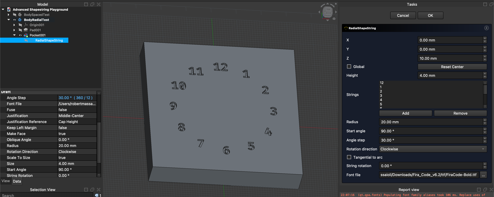

# ShapeStrings

FreeCAD Addon that integrated additional  
ShapeString tools into the Draft workbench.

[![Button Documentation]][Documentation] 
[![Button Contributing]][Contributing]

 

## Support

The latest version supports FreeCAD `1.0.2+`

 

## Showcase

<table>
<thead>
<tr>
<th> 
 Spaced 
</th>
<th> 
 Radial 
</th>
</tr>
</thead>
<tbody>
<tr>
<td>

</td>
<td>

</td>
</tr>
</tbody>
<tfoot>
<tr>
<td>Creating side-by-side ShapeStrings.</td>
<td>Creating circular aligned ShapeStrings.</td>
</tr>
</tfoot>
</table>

 

[Button Documentation]: https://img.shields.io/badge/Documentation-3b8ad9?style=for-the-badge&logoColor=white&logo=searxng
[Button Contributing]: https://img.shields.io/badge/Contributing-278d3f?style=for-the-badge&logoColor=white&logo=GitHub

[Documentation]: ./Documentation
[Contributing]: https://github.com/robertmassaioli/ShapeStrings?tab=contributing-ov-file